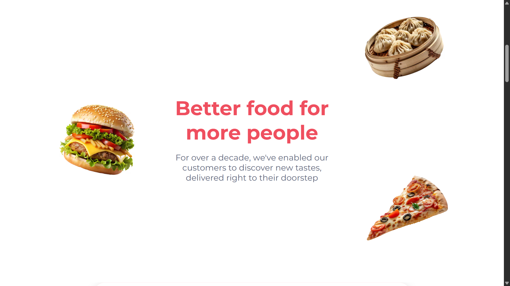

# Zomato Website Clone


A static frontend clone of the Zomato website built using HTML and CSS as part of a web development course assignment.

---

## 🌐 Live Demo

https://your-username.github.io/zomato-website-clone/

---

## ✨ Features

* Zomato homepage UI replica
* Clean and structured layout
* Static design (non-responsive)

---

## 📷 Screenshot

<p align="center">
  
</p>

---

## ⚙️ Project Setup

Clone the repository:

```bash
git clone https://github.com/ahmedaalam/zomato-website-clone.git
```

---

## 📌 Note

This project is a UI clone created for educational purposes only and is not affiliated with Zomato.
